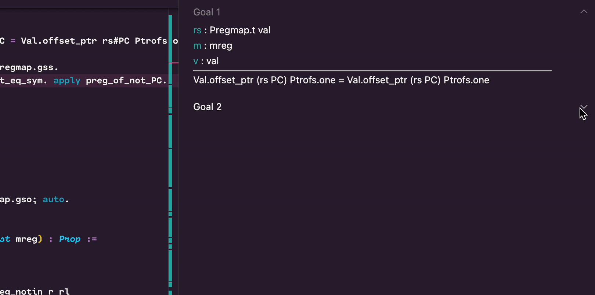
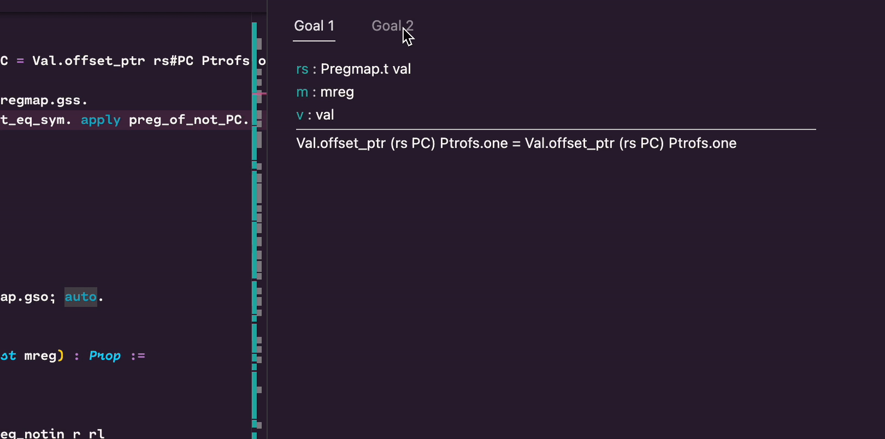

[![CI][action-shield]][action-link]
[![Contributing][contributing-shield]][contributing-link]
[![Code of Conduct][conduct-shield]][conduct-link]
[![Zulip][zulip-shield]][zulip-link]

[action-shield]: https://github.com/coq-community/vscoq/actions/workflows/ci.yml/badge.svg?branch=main
[action-link]: https://github.com/coq-community/vscoq/actions?query=workflow:ci

[contributing-shield]: https://img.shields.io/badge/contributions-welcome-%23f7931e.svg
[contributing-link]: https://github.com/coq-community/manifesto/blob/master/CONTRIBUTING.md

[conduct-shield]: https://img.shields.io/badge/%E2%9D%A4-code%20of%20conduct-%23f15a24.svg
[conduct-link]: https://github.com/coq-community/manifesto/blob/master/CODE_OF_CONDUCT.md

[zulip-shield]: https://img.shields.io/badge/chat-on%20zulip-%23c1272d.svg
[zulip-link]: https://coq.zulipchat.com/#narrow/stream/237662-VsCoq-devs.20.26.20users

VsCoq is an extension for [Visual Studio Code](https://code.visualstudio.com/)
(VS Code) and [VSCodium](https://vscodium.com/) which provides support for the [Coq Proof
Assistant](https://coq.inria.fr/).

This extension is currently developed and maintained as part of
[Coq Community](https://github.com/coq-community/manifesto) by
[Maxime Dénès](https://github.com/maximedenes),
[Paolo G. Giarrusso](https://github.com/Blaisorblade),
[Huỳnh Trần Khanh](https://github.com/huynhtrankhanh),
[Enrico Tassi](https://github.com/gares),
[Romain Tetley](https://github.com/rtetley),
[Laurent Théry](https://github.com/thery),
and contributors.

VsCoq is distributed in two flavours:

- **VsCoq Legacy** (required for Coq < 8.18, compatible with Coq >= 8.7) is based on the original 
  VsCoq implementation by [C.J. Bell](https://github.com/siegebell). It uses the legacy XML protocol 
  spoken by CoqIDE.\
  For more information, see the [VsCoq 1 branch](https://github.com/coq-community/vscoq/tree/vscoq1).
  *Please note it is no longer actively developed, but still maintained for compatibility purposes.*

- **VsCoq** (recommended for Coq >= 8.18) is a full reimplementation around a
  language server which natively speaks the 
  [LSP protocol](https://learn.microsoft.com/en-us/visualstudio/extensibility/language-server-protocol?view=vs-2022). 

## Installing VsCoq

To use VsCoq, you need to (1) install the VsCoq language server
and (2) install and configure the VsCoq extension in either VS Code or VSCodium.

### Installing the language server

After creating an opam switch, pin Coq,
and install the `vscoq-language-server` package:
```shell
$ opam pin add coq 8.18.0
$ opam install vscoq-language-server
```

After installation, check that you have `vscoqtop` in your shell
and note the path to this executable:
```shell
$ which vscoqtop
```

### Installing and configuring the extension

To install the [VS Code](https://marketplace.visualstudio.com/items?itemName=maximedenes.vscoq)
or [VSCodium extension](https://open-vsx.org/extension/maximedenes/vscoq), first run `code`
or `codium`. Then press F1 to open the command palette, start typing
"Extensions: Install Extension", press enter, and search for "vscoq". Switch to
the **pre-release version** of the extension and enable it. Finally, go to the extension
settings and enter the `vscoqtop` full path from above in the field "Vscoq: Path".

If you want top-down processing of Coq files as in VsCoq1, you can go to
the "Proof: Mode" and select "Manual". Otherwise, processing will asynchronous.

## Features
* Syntax highlighting
* Asynchronous proof checking
* Continuous and incremental checking of Coq documents

The new version of vscoq allows for continuous checking, see the goal panel update as you scroll or edit your document.


Note that users can opt out and choose to use the classic step by step checking mode. 


* Customisable goal panel 
  
Users can choose their preferred display mode, see goals in accordion lists...


... Or organized in tabs. 


* Dedicated panel for queries and their history

We now support a dedicated panel for queries. We currently support Search, Check, About, Locate and Print with plans 
to add more in the future.


* Messages in the goal panel

We also support inline queries which then trigger messages in the goal panel.


* Supports \_CoqProject

### Settings
After installation and activation of the extension:

(Press `F1` and start typing "settings" to open either workspace/project or user settings.)
#### Coq configuration
* `"vscoq.path": ""` -- specify the path to `vscoqtop` (e.g. `path/to/vscoq/bin/vscoqtop`)
* `"vscoq.args": []` -- an array of strings specifying additional command line arguments for `vscoqtop` (typically accepts the same flags as `coqtop`)
* `"vscoq.trace.server": off | messages | verbose` -- Toggles the tracing of communications between the server and client

#### Proof checking
* `"vscoq.proof.cursor.sticky": bool` -- a toggle to specify wether the cursor should move as Coq interactively navigates a document (step forward, backward, etc...)
* `"vscoq.proof.mode": Continuous | Manual` -- Decide wether documents should checked continuously or using the classig navigation commmands (defaults to `Continuous`)
* `"vscoq.proof.delegation": None | Skip | Delegate` -- Decides which delegation strategy should be used by the server. 
  `Skip` allows to skip proofs which are out of focus and should be used in manual mode. `Delegate` allocates a settable amount of workers
  to delegate proofs. 
* `"vscoq.proof.workers": int` -- Determines how many workers should be used for proof checking

#### Goal and info view panel
* `"vscoq.goals.diff.mode": on | off | removed` -- Toggles diff mode. If set to `removed`, only removed characters are shown (defaults to `off`)
* `"vscoq.goals.display": Tabs | List` -- Decide whether to display goals in seperate tabs or as a list of collapsibles.
* `"vscoq.goals.messages.full": bool` -- A toggle to include warning and errors in the proof view (defaults to `false`)

#### Diagnostics
* `"vscoq.diagnostics.full": bool` -- Toggles the printing of `Info` level diagnostics (defaults to `false`)

#### Code completion (experimental)
* `"vscoq.completion.enable": bool` -- Toggle code completion (defaults to `false`)
* `"vscoq.completion.algorithm": StructuredSplitUnification | SplitTypeIntersection` -- Which completion algorithm to use
* `"vscoq.completion.unificationLimit": int` -- Sets the limit for how many theorems unification is attempted

## For extension developers 
See [Dev docs](https://github.com/coq-community/vscoq/blob/main/docs/developers.md)

## License
Unless mentioned otherwise, files in this repository are [distributed under the MIT License](LICENSE).

The files `client/syntax/coq.tmLanguage` and `client/coq.configuration.json` are
also distributed under the MIT License, Copyright (c) Christian J. Bell and
contributors.
