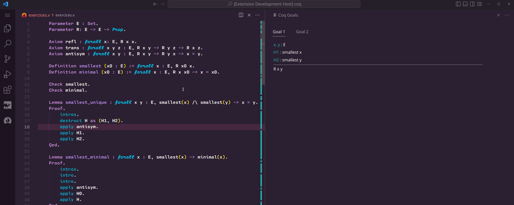

[![CI][action-shield]][action-link]
[![Contributing][contributing-shield]][contributing-link]
[![Code of Conduct][conduct-shield]][conduct-link]
[![Zulip][zulip-shield]][zulip-link]

[action-shield]: https://github.com/coq-community/vscoq/actions/workflows/ci.yml/badge.svg?branch=main
[action-link]: https://github.com/coq-community/vscoq/actions?query=workflow:ci

[contributing-shield]: https://img.shields.io/badge/contributions-welcome-%23f7931e.svg
[contributing-link]: https://github.com/coq-community/manifesto/blob/master/CONTRIBUTING.md

[conduct-shield]: https://img.shields.io/badge/%E2%9D%A4-code%20of%20conduct-%23f15a24.svg
[conduct-link]: https://github.com/coq-community/manifesto/blob/master/CODE_OF_CONDUCT.md

[zulip-shield]: https://img.shields.io/badge/chat-on%20zulip-%23c1272d.svg
[zulip-link]: https://coq.zulipchat.com/#narrow/stream/237662-VsCoq-devs.20.26.20users

VsCoq is an extension for [Visual Studio Code](https://code.visualstudio.com/)
(VS Code) and [VSCodium](https://vscodium.com/) with support for the [Coq Proof
Assistant](https://coq.inria.fr/).

This extension is currently developed as part of
[Coq Community](https://github.com/coq-community/manifesto) by [Maxime Dénès](https://github.com/maximedenes),
[Enrico Tassi](https://github.com/gares), [Romain Tetley](https://github.com/rtetley), and
contributors.

**This branch contains the VsCoq 2 language server and extension**. It is a full
reimplementation (based on a different architecture and design) of a previous
version of VsCoq, whose original author was @siegebell. See [the VsCoq 1
branch](https://github.com/coq-community/vscoq/tree/master) for the version of VsCoq that is on the Market Place.

## Status
VsCoq 2 is under heavy development and not ready for production use yet. It is
not yet released nor published on the VsCode marketplace.

## Features
* Continuous and incremental checking of Coq documents
* Asynchronous proof checking

* Customisable goal panel 

* Syntax highlighting
* Dedicated panel for queries and their history

* Supports \_CoqProject

## Requirements
* VS Code or VSCodium 1.38.0, or more recent
* VsCoq 2 currently ships with a custom Coq version, and will later require Coq 8.18

## Settings
(Press `F1` and start typing "settings" to open either workspace/project or user settings.)
* `"vscoq.path": ""` -- specify the path to `vscoqtop` (e.g. `path/to/vscoq/bin/vscoqtop`)
* `"vscoq.args": []` -- an array of strings specifying additional command line arguments for `vscoqtop` (typically accepts the same flags as `coqtop`)

## License
Unless mentioned otherwise, files in this repository are [distributed under the MIT License](LICENSE).

The files `client/syntax/coq.tmLanguage` and `client/coq.configuration.json` are
also distributed under the MIT License, Copyright (c) Christian J. Bell and
contributors.
