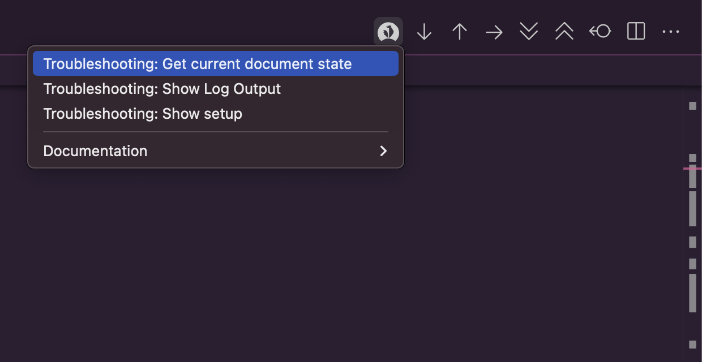

# Getting help

When you encounter a problem using this extension, it is helpful to paste the output of the ```Troubleshooting: Show Document State``` and ```Troubleshooting: Show Setup``` options from the Coq menu.



When asking a question on zulip, please try to use minimal examples.