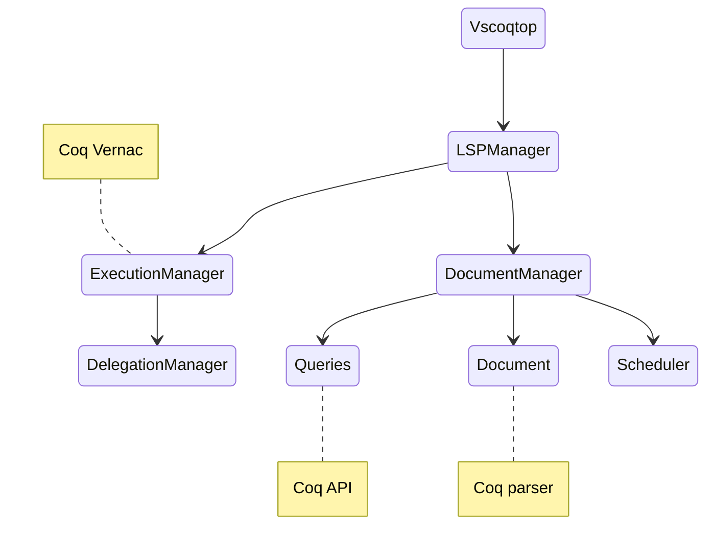

# Development 

This page is intended for software developers who wish to help with the VsCoq2 development effort. 

The two main building blocks are the language server and the client (the vscode extension, namely). 

## Language server

The language server is developed in ocaml and makes it possible to link from the client directly to the coq API and exploit [LSP](https://microsoft.github.io/language-server-protocol/specifications/lsp/3.17/specification/). 

### Architecture 

The architecture is organized in the following components.
* **VsCoqtop:** This component handles the main event loop.
* **LSPManager:** This component handles the JSONRPC encoding, LSP requests, notifications and responses as well as LSP events dispatch.
* **DocumentManager:** The document manager handles everything that pertains to document representation and parsing.
* **Document:** Raw and parsed document representations.
* **Scheduler:** Incremental static dependency analysis.
* **Queries:** This handles the coq queries (Search, About, etc...)
* **Execution manager:** Maintains coq states. Handles execution and feedback.
* **Delegation manager:** Handles worker tasks and feedback.



### Building

If you have nix installed, you can do a full developer build of the language server by running:

```
nix develop .#vscoq-language-server -c bash -c "cd language-server && dune build"
```

### Composing the build with Coq

We assume you are in a directory `coq/` where you have a coq checkout (built or not).
You can git clone the vscoq repository in `coq/vscoq/` (next to, say, `kernel/`).
Then `dune build vscoq/language-server` will build the server, typically in
`_build/install/default/bin/vscoqtop` (next to the coq binaries).

In order to use this binary, point the `vscoq.path` option to that path (better in its absolute form).

Whenever you change the Coq sources `dune build` will also rebuild vscoqtop.
If you specify a more specific dune target, remember that vscoqtop is *linked* to Coq,
so if you don't rebuild it it will not work.

### Debugging

## Client 

The client is the VSCode extension in itself. Apart from the usual [VSCode](https://code.visualstudio.com/api) lingo, we develop two web apps that are used within separate panels in the extension and are specific to Coq, namely the goal-view-ui and the search-view-ui.

### Design pattern for the web apps

Both of the two coq exclusive panels are react apps. We use the [atomic design pattern](https://atomicdesign.bradfrost.com/table-of-contents/) and the [VSCode webview UI toolkit](https://github.com/microsoft/vscode-webview-ui-toolkit). 

### Building 

* Make sure you have up to date `yarn` and `node.js`. For example, at the time of writing this guide, `yarn` version 1.22.19 and `node.js` version 19.0.1
* From the client folder run `yarn run install:all` which will ensure all dependencies are installed for the extension and the web apps. 
* Still from the client folder, run `yarn run build:all`  this will ensure that both web apps are built. 
* You can then run `yarn run compile` which will compile the extension.
* To package the extension run `yarn run package`
* To make an installable `.vsx` package, use `npm install -g @vscode/vsce` (once) and `vsce package`.
  This package can be installed locally in any code workspace or all (not recommended, as it can overwrite an existing 
  globally installed vsx `code --install-extension vscoq-*.vsix`)
* For publishing to VSCode market place use the [vsce tool](https://code.visualstudio.com/api/working-with-extensions/publishing-extension)

### Debugging 

You can debug the web apps independently. From the client folder just run `yarn run start:goal-view-ui` or `yarn run start:search-ui`. This will launch the corresponding web app in local development server. You can then access it through your usual browser or the VSCode browser. 

Note that both the apps can also be built independently through the `yarn run build:goal-view-ui` or `yarn run build:search-ui` commands. 

To launch the extension in debug mode, assuming you have built the language-server, you can either use a nix dev shell to run vscode (`nix develop .#vscoq-client -c code .`) or handle your own config.

Note that you need to set the path to vscoqtop in the VSCode user settings (just search for vscoq).

## E2E tests

From the client folder run `yarn test`. To pass arguments to the language
server you can use the `VSCOQARGS` env variable, e.g.

```shell
VSCOQARGS='-vscoq-d all' yarn test
```
Remember that if the language server fails to initialize, the log is not
displayed in the output panel as usual, but rather written to a file named
like `/tmp/vscoq_init_log.xxx`.

To run the tests on a language server not in a standard location (not in
the language-server folder nor in PATH), set `VSCOQPATH` to the binary you
want to be run by the test.

# Release process 

To release a new version of VsCoq: 

1. First make sure to bump the version number in the three folowing files: 
    - flake.nix
    - client/package.json
    - language-server/vscoqtop/lspManager.ml

1.a Don't forget to add the version requirements in `client/src/utilities/versioning.ts`
  
2. Create a signed tag for the release with the new version number 
```shell
    git tag -s #VERSION_NUMBER
```
3. Push
```shell 
    git push origin #VERSION_NUMBER
```

~~Version semantics are currently as follows: v#NUMBER+coq#COQ_VERSION (ex: v1.9.2+coq.8.18)~~
Since we now use opt comp and support all coq versions, version semantics are v2.#.# (ex: v2.2.2)

Once the CI has run, a draft release will be automatically created. Open the draft release and edit the change log to your liking.
Finally, light a candle, do a little prayer and click release !

After the opam package has been published (PR merged by opam maintainers), the user should then use ```publish-extension.yml``` to publish the extensions on the vscode marketplace as well as vscodium.

# CI/CD pipeline for release process

The CI pipeline (```ci.yml```) handles creating the draft release (with a tarball archive) when a tag is pushed. This is done in the ```create-release``` job.

The CD pipeline (```cd.yml```) automatically publishes the release to opam once the draft is released. Don't forget to fill out the change log
appropriately before hitting release. If it is a pre-release, the pipeline will publish to ```coq/opam``` instead of ```opam/opam-repository```.

There are two manual pipelines:
- ```publish-server.yml``` allows to publish a release on opam manually (if the automatic pipeline goes wrong). The user only need to give the tag (with the correct version semantics) and specify if it is a release or pre-release.
- ```publish-extension.yml``` handles publishing the extension on the vscode market place as well as vscodium. **This is always done manually because the opam release process might take some time. The extensions should only be published once the package is on opam.**